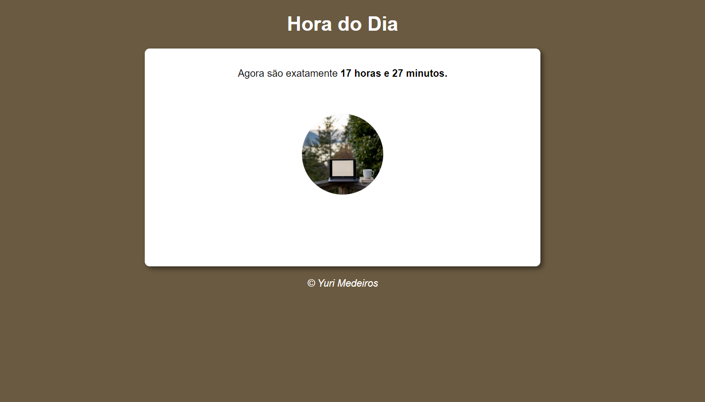
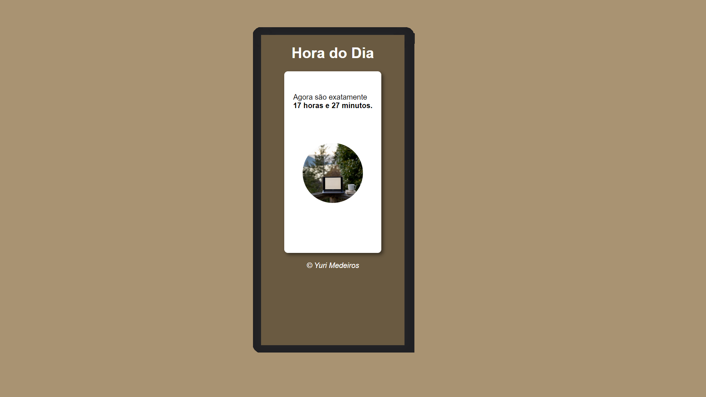

# Timer

> Timer Interface running in a Large Screen/ Interface do Timer(Relógio) funcionando em uma tela de alta escala.

> Timer Interface running in a Mobile Screen/ Interface do Timer(Relógio) funcionando em um dispositivo móvel.

### Click at link below to see it working! / Clique no link abaixo para vê-lo funcionando!
<!-- <a href="https://yurimayk.github.io/Calculator/">Clique aqui!</a> -->

### Project steps/Etapas do Projeto

The project is still under development. Below are the current definitions of performed tasks and upcoming updates:
 
O projeto ainda está em desenvolvimento. Abaixo estão as definições atuais de tarefas executadas e atualizações futuras:

- [x] Create HTML/Criar estrutura HTML;
- [x] Create CSS/Estilização com CSS;
- [x] Improve responsiveness/Aprimorar responsividade;
- [x] Add JavaScript/Adicionar JavaScript;
- [ ] Make the project available online/Disponibilizar o projeto, online;
- [ ] Add Functions.

## 🤝 Contributor/Colaborador

The creator, and developer, of this project:
 
O criador e desenvolvedor deste projeto:

<table>
  <tr>
    <td align="center">
      <a href="#">
         
        
          <a href="https://www.linkedin.com/in/yurimayk/" target="_blank"><b>Yuri Medeiros</b></a>
        
      </a>
    </td>
</table>

[⬆ Voltar ao topo](#nome-do-projeto) 
